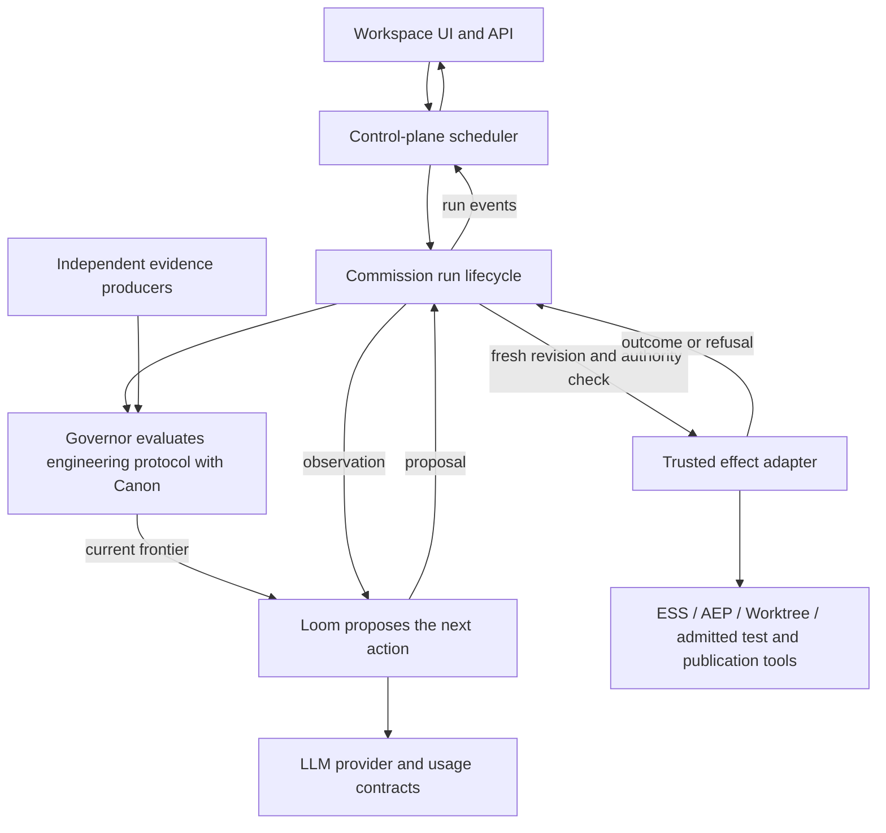

# Runtime ownership

Control-plane is the multi-workspace application and scheduler. Loom supplies agent execution. A planner, implementor and reviewer are configurations of that execution, not three independently implemented runtimes.

This audit distinguishes logical ownership from repository packaging: the pinned Loom repository includes Commission, the Canon governor and intake. They are separate responsibilities exposed through one SDK. No replacement repositories or higher-level agent service are needed.

## Evidence basis

Inspected the actual dependency pin, beyond10x/loom `75eeb4062690c0505673ef8ccd2b7a6a4b2b58ce`, rather than relying on a stale sibling README. Public source anchors:

- [SDK exports and responsibilities](https://github.com/beyond10x/loom/blob/75eeb4062690c0505673ef8ccd2b7a6a4b2b58ce/crates/loom-sdk/src/lib.rs).
- [Native turn loop](https://github.com/beyond10x/loom/blob/75eeb4062690c0505673ef8ccd2b7a6a4b2b58ce/crates/loom-executor/src/harness/turn_loop/mod.rs), including AgentLoop, LoopConfig, RunLedger, LoopSink, cancellation and TurnEnvironmentProvider.
- [Session storage](https://github.com/beyond10x/loom/blob/75eeb4062690c0505673ef8ccd2b7a6a4b2b58ce/crates/loom-executor/src/session.rs). The ported harness turn loop implements compaction; the separate top-level compaction.rs and recovery.rs are placeholders at this pin. Their names are not proof of a completed governed integration.
- [Commission effect contract](https://github.com/beyond10x/loom/blob/75eeb4062690c0505673ef8ccd2b7a6a4b2b58ce/crates/loom-commission/src/ports/effect.rs): a normal outcome/refusal is different from inability to answer.
- [Existing local effect adapter](https://github.com/beyond10x/loom/blob/75eeb4062690c0505673ef8ccd2b7a6a4b2b58ce/crates/loom-intake-slice/src/effect.rs): an unreadable repository path returns Refused and tells the model why.
- [Governor and CaseStore](https://github.com/beyond10x/loom/blob/75eeb4062690c0505673ef8ccd2b7a6a4b2b58ce/crates/loom-governor/src/lib.rs).

## Ownership map

| Responsibility | Owner | Control-plane's part |
| --- | --- | --- |
| Workspace registry, directories, goals, operator API/UI | Control-plane; types/lifecycles specified in ESS | Own these product behaviors and persist their commands. |
| Which goal runs next; worker slots; repository contention | Control-plane scheduler | Allocate a bounded run and worktree. Schedule across runs, never implement the turns inside one. |
| Model turns, transcript, context assembly/compaction, streaming, interruption and within-run budgets | Loom executor | Supply role instructions, authorized workspace context, model choice and limits. Persist references and render emitted events. |
| Commission/run lifecycle; fresh authority and revision checks immediately before each effect | Commission runtime, packaged in Loom SDK | Supply operator authority and effect bindings; request cancel/resume through runtime contracts. No direct fleet effect bypass. |
| Frontier, obligations, applicability of evidence, earned case completion | Canon governor, packaged in Loom SDK | Supply the case store and selected protocol. Project decisions; do not write a second governor. |
| Meaning and sequencing of engineering work; evidence required for planning/review/merge | Engineering protocols, evaluated by Canon | Select a small profile for source delivery. Supply product-specific declarations only through the protocol admission contract. |
| ESS syntax, schema semantics, validation and conformance | ESS | Mount authoritative schema/help and invoke the compiler. Do not teach an invented schema through improvised prose. |
| Planning artifacts, their lifecycle and provenance | AEP | Invoke its public API/CLI. Do not maintain a shadow backlog or use artifact status as model proof. |
| Provider wires, credential resolution, usage attribution and cost arithmetic/reservations | LLM | Choose configured model and allocate an operator budget; display observed spend/unknowns. Loom enforces its allocated run budget. |
| Tool operation implementation and truthful outcome classification | Trusted effect adapter, called by Commission | Bind the admitted workspace/repo/test/publisher. Return Performed, Refused or actual unavailability faithfully. |
| Process/filesystem confinement | Substrate; operation integration through the declared connector binding where available | Configure scope and environment. A managed worktree is isolation of Git work, not a sandbox. Never claim confinement from a path allowlist alone. |
| Git worktree ownership, leases, recovery and cleanup | Worktree | Request a tree, retain its id, heartbeat and finish/archive through the CLI. |
| Durable append/replay and storage guarantees | Eventlog | Implement product and runtime-store adapters. Domain and authority decisions remain above the storage library. |
| Tests, review and observed publication evidence | Independent evidence producers, admitted by the governor | Configure the checker, run a separate reviewer context, and bind results to exact revisions. UI activity and model claims are observations, not proof. |
| App-specific eval fixtures and black-box assertions | This consumer's test/eval tooling | Keep generated examples outside product source and checks outside writable candidate scope. |
| Generic harness comparison, transcript evaluation and eval-run orchestration | Metaharness | Optional development tooling; do not pull its higher orchestration into the production control-plane. |

The scheduler may enforce a workspace-wide spend or concurrency ceiling and pass a smaller allocation to Loom. That is allocation above a run, not another implementation of Loom's turn/token/time accounting. Similarly, the host may persist and display run events without becoming the owner of transcript construction or recovery semantics.

## Intended flow

The diagram is the required composition. It does not assert that the pinned SDK already exposes one complete, durable, hosted composition of all those pieces. In particular, raw AgentLoop tools must not invoke consequential effects outside Commission. Replacing the fleet's loop with an unconstrained AgentLoop would preserve the architectural bug.

## Current deviations and disposition

| Current code | Finding | Disposition |
| --- | --- | --- |
| runtime/model.rs | Calls LLM directly for a forced response; each role gets a fresh model request. | Replace per-role invocation machinery with the shared Loom execution/model adapter. Keep role configuration. |
| runtime/context.rs and engine.rs transcript/prompt state | Product code rebuilds bounded context and action history. It previously hit a 1 MiB failure and repeated unchanged actions. | Reuse Loom context/session/budget machinery; generic no-progress behavior belongs with the reusable executor. Product facts enter through context inputs. |
| runtime/engine.rs Governor implementation | Product owns a second frontier/completion implementation around Canon and ephemeral state. | Use SDK governor; resolve its protocol-registration and fallible-store gaps in their owner first. |
| runtime/engine.rs EffectPort | All unhandled errors became EffectError; ordinary missing reads suspended the run. | Use the existing outcome/refusal contract. Adapt operation-specific errors, not the runtime's decision to suspend. Offline patches are regression evidence, not the completed boundary correction. |
| runtime/fleet.rs implementation() | Own max_steps/model/tool loop; does not run that loop through Commission. | Remove it in favor of the same governed Loom run used for planning/review. Preserve scheduling and repository contention logic. |
| runtime/fleet.rs delivery/review/publication sequencing | Product Rust decides the engineering sequence and calls publication after custom checks. | Put legitimacy/order in the engineering profile; Commission invokes the trusted publication adapter after revalidation. Keep durable intent/remote reconciliation as effect-adapter responsibilities. |
| control-plane-protocol and its two YAML protocols | Local planning and source-merge profiles have valid narrower requirements but create a parallel governing integration. | Reconcile reusable planning/source-delivery profiles with engineering protocols and consume them through the SDK governor. Do not drop independent review or add release/deploy merely to fit a built-in. |
| supervisor.rs, core and app | Workspace orchestration, operator controls, durable product state, scheduling and presentation. | Retain; replace executor internals beneath them. No restart-from-zero or database wipe. |
| process.rs and Rust-only source restrictions | Product contains generic process handling and language policy. | Put execution guarantees in the execution substrate/adapter. Repository language rules are scoped configuration, not universal platform semantics. |

## Actual foundation gaps to resolve

1. **Governed native-session composition — Loom SDK.** The pin contains both AgentLoop/session facilities and the frontier-driven Loom executor, but the SDK example and intake path do not demonstrate their complete hosted composition. Top-level compaction.rs and recovery.rs remain placeholders even though the ported harness implements compaction and session.rs implements filing. Prove the existing bridge or add a reusable one in Loom. It must retain tool outcomes in the session, expose streaming and cancellation, enforce budgets and leave effect invocation with Commission. Do not make a third bridge private to control-plane.
2. **Durable governor storage failures — Loom governor/Commission contracts.** CaseStore insert/get/update/observe has no error channel in the inspected API. A failed append cannot safely masquerade as an absent case or duplicate id. Define a fallible persistence contract and fail before effects; Eventlog supplies storage mechanics, not invented success.
3. **Appropriate admitted protocol — engineering protocols plus SDK governor.** CanonGovernor loads registered built-ins. The existing software-change profile's accepted outcome includes release/deployment/objective observations, while this product ends at independently reviewed, observed source publication. A reviewed source-delivery profile and planner protocol must be admitted by the owner; bypassing that with another governor is not the answer.
4. **Effect containment binding — Commission/Connectors/Substrate.** The pinned local effect adapter explicitly has no sandbox and does not merge. Reuse its correct refusal semantics, but do not claim it already provides the required publisher or confinement. Host-specific test/publish configuration may remain an adapter; generic binding and containment belong to the foundations.

These are capability findings, not permission to discard checks or import an unrelated higher-level product. Future work must target exact owned seams and retain compatibility.

## Proof before another paid run

Named scenarios for the boundary-correction story:

- `shared-governed-executor`: planner, implementor and reviewer use the same SDK run path; no production model-call loop remains in control-plane.
- `missing-file-refusal-roundtrip`: an admitted missing read becomes a model-visible refusal, the model creates the file, and the same run continues.
- `no-change-is-not-progress`: identical writes preserve the artifact revision and consume a bounded no-progress allowance.
- `stale-authority-before-effect`: a cancelled goal or changed revision between proposal and invocation prevents the actual effect.
- `session-budget-restart`: restart retains session, observations and spent budget without replaying an uncertain effect.
- `storage-failure-stops-effects`: failed case/run persistence invokes no tool and is never treated as absence.
- `visible-runtime-events`: the UI renders real request, outcome/refusal, usage and stop events from the runtime; heartbeat remains separately labeled.
- `current-review-and-publication`: acceptance requires checks and independent review for the exact candidate plus observed publication; a transcript or zero exit alone cannot satisfy it.

Use the actual Loom runtime with scripted ModelPort/provider responses for these tests, not a fake replacement for the runtime. Keep the two real auth-eval failures and all existing workspaces as fixtures. After these pass, run one bounded external eval and report its result, including failure. No additional paid retry is part of this audit.

## Resolution on the corrected pin

The baseline audit above records commit 75eeb4062690c0505673ef8ccd2b7a6a4b2b58ce. The implemented dependency is published Loom 1b25fe8939e1883f3e47c1292ac90cf75fc3f3a5. The baseline deviation table describes the pre-correction source, not the final implementation.

The original concern about a missing native-session composition is resolved using existing supported APIs: AgentLoop, OutputSchema, SessionFile, ModelPort and Commission. The host projects its LLM provider into ModelPort, carries opaque provenance losslessly, supplies new observations, files the SDK session and renders runtime events. Loom still owns the turn loop, compaction, structured proposal validation and session representation. This does not establish a missing foundation API or justify another executor.

The demonstrated governor gaps were real: CaseStore had no error channel; CanonGovernor admitted only built-ins; freshness could not be supplied by the trusted host clock. The foundation commit adds FallibleCaseStore, with_protocol_yaml/with_protocol and with_evaluation_time. Its tests reject store failures, duplicate/replaced protocols and multiple capability truncation. Both roles now use that governor. Product-specific planning/source-delivery profiles are validated host configuration; no engineering-protocols release is claimed.

Fleet actions and publication now enter Commission, with current operator revision/authority and candidate/base checks. Publication intent persistence and remote observation remain host responsibilities. Goal/workspace state, contention, scheduling, API and UI remain control-plane responsibilities. The provider adapter no longer calls the forced-tool shortcut; all roles use native Loom sessions with independent reviewer contexts.

Cases remain bounded-attempt state with fallible event journaling, not a claimed durable case-replay database. Restart retains product records and filed Loom sessions and revalidates through fresh cases. A crash-left Active session is refused rather than automatically recovered with invented spend. Process confinement is still not a property of a local path allowlist. These limitations remain explicit.

Root verification passed task check, including 167 conformance scenarios with no failures/errors/unsupported/skips. Native regressions cover real ESS/AEP missing-file recovery and full candidate checks/review/observed local publication. Deliberate continuation loss fails its regression; restored continuation passes. A midstream progress-write failure initially failed cancellation, then passed after token propagation. Independent review found no authority/provenance/publication bypass. Real-provider eval outcome is recorded separately and is required before completion.
