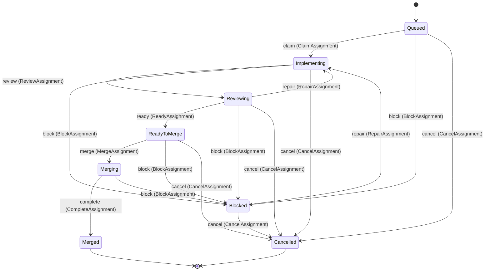
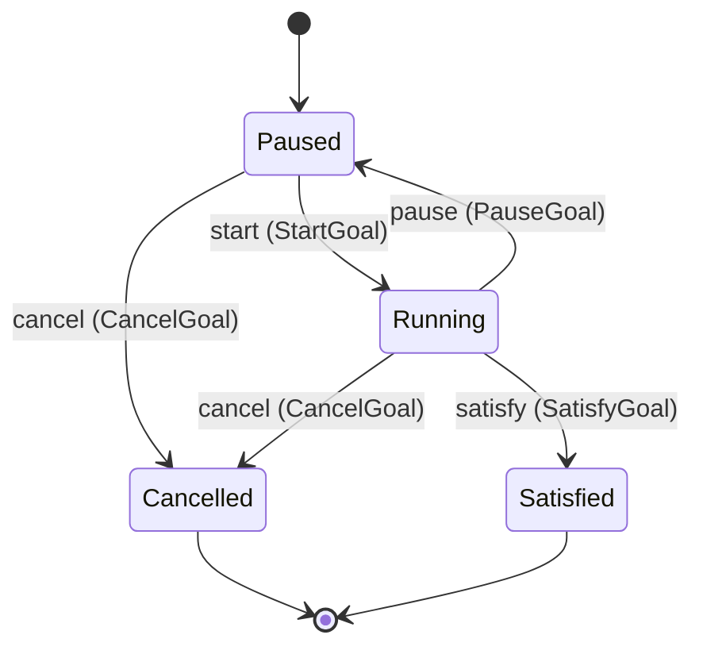
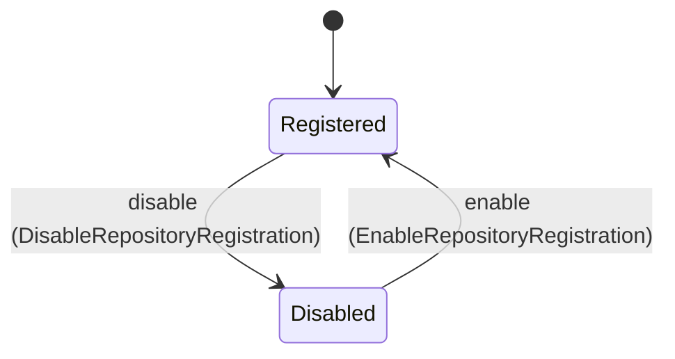
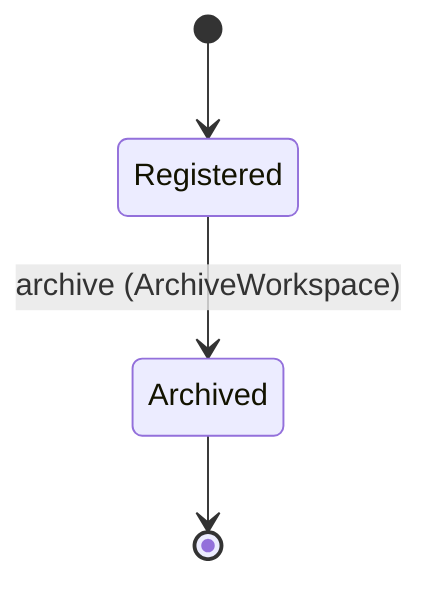

<!--
generated from controlplane v1
model digest 8e307f3ce0541f736b4688846bf3bc3617af6ba4bd43e0b156673e614f1f8a57
contract digest slice-sha256/2:c4a296ae41814f3a2a24c5f55da9b458369ad96cbca829869fd81211af1fd1ed
do not edit: regenerate with `ess generate`
-->

# host

Local workspace goals and assignments; AEP owns stories, Loom owns agent executions.

`controlplane.host` is one of controlplane's bounded contexts. [Back to the index](../index.md).

## Entities

An entity is what this context is about: something with an identity that outlives any one request, a shape, and a lifecycle. The lifecycle is exhaustive — a move that is not drawn below is a move this specification does not permit, and that is the only way it says so. Every move is labelled with the command that takes it, because a move nothing can trigger is refused rather than drawn.

### `Assignment`

`controlplane.host.Assignment`.

An instance is identified by `assignment_id`, a `Uuid`. The name is part of the model and not a convention: a view projects the identity under that name, so a projection inventing its own would disagree with the view.

It holds:

- `goal_id` — `Uuid`
- `repository_id` — `Uuid`
- `story_id` — `String`
- `case_id` — `String`
- `worktree_id` — `String`
- `candidate` — `String`
- `attempt` — `Integer`
- `reason` — `String`
- `implementor_run` — `String`
- `reviewer_run` — `String`

It references at most one [`RepositoryRegistration`](#repositoryregistration), as `repository`, carried by `Assignment.repository_id`. Its `goal_id` is what [`Goal`](#goal) owns it by, as `assignments`.

No invariant is declared, so nothing here constrains an instance at rest.

Its state is a `controlplane.host.Assignment.State`, one of `Blocked`, `Cancelled`, `Implementing`, `Merged`, `Merging`, `Queued`, `ReadyToMerge` and `Reviewing`. That enum is synthesised from the lifecycle rather than declared beside it, so the states a view's filter compares and the states drawn below cannot disagree.

An instance is created in `Queued`. `Cancelled` and `Merged` are terminal, so an instance may rest there forever. That is declared rather than inferred from having no way out: an entity that cannot leave a state is either finished or stuck, and only its author knows which.

Each move is taken by a declared command outcome, and a move nothing takes is refused as `missing_causation` rather than left as a state change nobody can trigger:

- `claim` — taken by `controlplane.host.ClaimAssignment` on its `applied` outcome
- `review` — taken by `controlplane.host.ReviewAssignment` on its `applied` outcome
- `repair` — taken by `controlplane.host.RepairAssignment` on its `applied` outcome
- `ready` — taken by `controlplane.host.ReadyAssignment` on its `applied` outcome
- `merge` — taken by `controlplane.host.MergeAssignment` on its `applied` outcome
- `complete` — taken by `controlplane.host.CompleteAssignment` on its `applied` outcome
- `block` — taken by `controlplane.host.BlockAssignment` on its `applied` outcome
- `cancel` — taken by `controlplane.host.CancelAssignment` on its `applied` outcome

An instance is brought into existence by `controlplane.host.QueueAssignment` on its `created` outcome.

Illegal transitions are illegal by absence: no rule forbids them, there is simply no arrow, because a rule would be a second place for the same truth to live. A diagram cannot show an absence, so the pairs it does not connect are listed here, derived from the same transitions — anything named below is a move this specification does not permit.

- `Blocked` may not become `Merged`
- `Blocked` may not become `Merging`
- `Blocked` may not become `Queued`
- `Blocked` may not become `ReadyToMerge`
- `Blocked` may not become `Reviewing`
- `Cancelled` may not become `Blocked`
- `Cancelled` may not become `Implementing`
- `Cancelled` may not become `Merged`
- `Cancelled` may not become `Merging`
- `Cancelled` may not become `Queued`
- `Cancelled` may not become `ReadyToMerge`
- `Cancelled` may not become `Reviewing`
- `Implementing` may not become `Merged`
- `Implementing` may not become `Merging`
- `Implementing` may not become `Queued`
- `Implementing` may not become `ReadyToMerge`
- `Merged` may not become `Blocked`
- `Merged` may not become `Cancelled`
- `Merged` may not become `Implementing`
- `Merged` may not become `Merging`
- `Merged` may not become `Queued`
- `Merged` may not become `ReadyToMerge`
- `Merged` may not become `Reviewing`
- `Merging` may not become `Cancelled`
- `Merging` may not become `Implementing`
- `Merging` may not become `Queued`
- `Merging` may not become `ReadyToMerge`
- `Merging` may not become `Reviewing`
- `Queued` may not become `Merged`
- `Queued` may not become `Merging`
- `Queued` may not become `ReadyToMerge`
- `Queued` may not become `Reviewing`
- `ReadyToMerge` may not become `Implementing`
- `ReadyToMerge` may not become `Merged`
- `ReadyToMerge` may not become `Queued`
- `ReadyToMerge` may not become `Reviewing`
- `Reviewing` may not become `Merged`
- `Reviewing` may not become `Merging`
- `Reviewing` may not become `Queued`

One view projects it: [`AssignmentList`](#assignmentlist).

### `Goal`

`controlplane.host.Goal`.

An instance is identified by `goal_id`, a `Uuid`. The name is part of the model and not a convention: a view projects the identity under that name, so a projection inventing its own would disagree with the view.

It holds:

- `workspace_id` — `Uuid`
- `objective` — `String`
- `acceptance` — `String`
- `max_workers` — `Integer`
- `max_attempts` — `Integer`
- `max_minutes` — `Integer`
- `planner_model` — `String`
- `implementor_model` — `String`
- `reviewer_model` — `String`
- `merge_authority` — `Boolean`

It owns any number of [`Assignment`](#assignment), as `assignments`, carried by `Assignment.goal_id`. Its `workspace_id` is what [`Workspace`](#workspace) owns it by, as `goals`.

No invariant is declared, so nothing here constrains an instance at rest.

Its state is a `controlplane.host.Goal.State`, one of `Cancelled`, `Paused`, `Running` and `Satisfied`. That enum is synthesised from the lifecycle rather than declared beside it, so the states a view's filter compares and the states drawn below cannot disagree.

An instance is created in `Paused`. `Cancelled` and `Satisfied` are terminal, so an instance may rest there forever. That is declared rather than inferred from having no way out: an entity that cannot leave a state is either finished or stuck, and only its author knows which.

Each move is taken by a declared command outcome, and a move nothing takes is refused as `missing_causation` rather than left as a state change nobody can trigger:

- `start` — taken by `controlplane.host.StartGoal` on its `applied` outcome
- `pause` — taken by `controlplane.host.PauseGoal` on its `applied` outcome
- `satisfy` — taken by `controlplane.host.SatisfyGoal` on its `applied` outcome
- `cancel` — taken by `controlplane.host.CancelGoal` on its `applied` outcome

An instance is brought into existence by `controlplane.host.CreateGoal` on its `created` outcome.

Illegal transitions are illegal by absence: no rule forbids them, there is simply no arrow, because a rule would be a second place for the same truth to live. A diagram cannot show an absence, so the pairs it does not connect are listed here, derived from the same transitions — anything named below is a move this specification does not permit.

- `Cancelled` may not become `Paused`
- `Cancelled` may not become `Running`
- `Cancelled` may not become `Satisfied`
- `Paused` may not become `Satisfied`
- `Satisfied` may not become `Cancelled`
- `Satisfied` may not become `Paused`
- `Satisfied` may not become `Running`

One view projects it: [`GoalList`](#goallist).

### `RepositoryRegistration`

`controlplane.host.RepositoryRegistration`.

An instance is identified by `repository_id`, a `Uuid`. The name is part of the model and not a convention: a view projects the identity under that name, so a projection inventing its own would disagree with the view.

It holds:

- `workspace_id` — `Uuid`
- `name` — `String`
- `path` — `String`
- `common_dir` — `String`
- `base_branch` — `String`
- `test_command` — `String`
- `publish_command` — `String`

Its `workspace_id` is what [`Workspace`](#workspace) owns it by, as `repositories`.

No invariant is declared, so nothing here constrains an instance at rest.

Its state is a `controlplane.host.RepositoryRegistration.State`, one of `Disabled` and `Registered`. That enum is synthesised from the lifecycle rather than declared beside it, so the states a view's filter compares and the states drawn below cannot disagree.

An instance is created in `Registered`. No state is terminal: nothing in this lifecycle says an instance may stop moving.

Each move is taken by a declared command outcome, and a move nothing takes is refused as `missing_causation` rather than left as a state change nobody can trigger:

- `disable` — taken by `controlplane.host.DisableRepositoryRegistration` on its `applied` outcome
- `enable` — taken by `controlplane.host.EnableRepositoryRegistration` on its `applied` outcome

An instance is brought into existence by `controlplane.host.RegisterRepository` on its `created` outcome.

Every ordered pair of these states is connected by some move, so this lifecycle forbids nothing.

One view projects it: [`RepositoryRegistrationList`](#repositoryregistrationlist).

### `Workspace`

`controlplane.host.Workspace`.

An instance is identified by `workspace_id`, a `Uuid`. The name is part of the model and not a convention: a view projects the identity under that name, so a projection inventing its own would disagree with the view.

It holds:

- `path` — `String`
- `name` — `String`

It owns any number of [`RepositoryRegistration`](#repositoryregistration), as `repositories`, carried by `RepositoryRegistration.workspace_id`. It owns any number of [`Goal`](#goal), as `goals`, carried by `Goal.workspace_id`.

No invariant is declared, so nothing here constrains an instance at rest.

Its state is a `controlplane.host.Workspace.State`, one of `Archived` and `Registered`. That enum is synthesised from the lifecycle rather than declared beside it, so the states a view's filter compares and the states drawn below cannot disagree.

An instance is created in `Registered`. `Archived` is terminal, so an instance may rest there forever. That is declared rather than inferred from having no way out: an entity that cannot leave a state is either finished or stuck, and only its author knows which.

Each move is taken by a declared command outcome, and a move nothing takes is refused as `missing_causation` rather than left as a state change nobody can trigger:

- `archive` — taken by `controlplane.host.ArchiveWorkspace` on its `applied` outcome

An instance is brought into existence by `controlplane.host.RegisterWorkspace` on its `created` outcome.

Illegal transitions are illegal by absence: no rule forbids them, there is simply no arrow, because a rule would be a second place for the same truth to live. A diagram cannot show an absence, so the pairs it does not connect are listed here, derived from the same transitions — anything named below is a move this specification does not permit.

- `Archived` may not become `Registered`

One view projects it: [`WorkspaceList`](#workspacelist).

## Views

A view is what the outside world is promised it can observe. Each one says which instances it contains and how soon it reflects a command that has already returned, because "you can read this" without "how soon" is the promise every flaky suite is built on.

### `AssignmentList`

`controlplane.host.AssignmentList`.

It reads [`Assignment`](#assignment).

It contains every instance of that entity: no filter narrows it, which is a decision somebody made and not a line somebody omitted.

It exposes:

- `assignment_id` — `Uuid`
- `goal_id` — `Uuid`
- `repository_id` — `Uuid`
- `story_id` — `String`
- `case_id` — `String`
- `worktree_id` — `String`
- `candidate` — `String`
- `attempt` — `Integer`
- `reason` — `String`
- `implementor_run` — `String`
- `reviewer_run` — `String`
- `state` — `controlplane.host.Assignment.State`

It declares no order, so the rows come back in whatever order the implementation has, and two reads may disagree.

**Read-your-writes**: it is current the moment the command that changed it returns. A caller that has just created an invoice and cannot see it in here has been told a lie about what it did.

A generated scenario asserts it once, immediately after the command: a view promising this and not keeping the promise has to fail the suite rather than be retried until it passes.

### `GoalList`

`controlplane.host.GoalList`.

It reads [`Goal`](#goal).

It contains every instance of that entity: no filter narrows it, which is a decision somebody made and not a line somebody omitted.

It exposes:

- `goal_id` — `Uuid`
- `workspace_id` — `Uuid`
- `objective` — `String`
- `acceptance` — `String`
- `max_workers` — `Integer`
- `max_attempts` — `Integer`
- `max_minutes` — `Integer`
- `planner_model` — `String`
- `implementor_model` — `String`
- `reviewer_model` — `String`
- `merge_authority` — `Boolean`
- `state` — `controlplane.host.Goal.State`

It declares no order, so the rows come back in whatever order the implementation has, and two reads may disagree.

**Read-your-writes**: it is current the moment the command that changed it returns. A caller that has just created an invoice and cannot see it in here has been told a lie about what it did.

A generated scenario asserts it once, immediately after the command: a view promising this and not keeping the promise has to fail the suite rather than be retried until it passes.

### `RepositoryRegistrationList`

`controlplane.host.RepositoryRegistrationList`.

It reads [`RepositoryRegistration`](#repositoryregistration).

It contains every instance of that entity: no filter narrows it, which is a decision somebody made and not a line somebody omitted.

It exposes:

- `repository_id` — `Uuid`
- `workspace_id` — `Uuid`
- `name` — `String`
- `path` — `String`
- `common_dir` — `String`
- `base_branch` — `String`
- `test_command` — `String`
- `publish_command` — `String`
- `state` — `controlplane.host.RepositoryRegistration.State`

It declares no order, so the rows come back in whatever order the implementation has, and two reads may disagree.

**Read-your-writes**: it is current the moment the command that changed it returns. A caller that has just created an invoice and cannot see it in here has been told a lie about what it did.

A generated scenario asserts it once, immediately after the command: a view promising this and not keeping the promise has to fail the suite rather than be retried until it passes.

### `WorkspaceList`

`controlplane.host.WorkspaceList`.

It reads [`Workspace`](#workspace).

It contains every instance of that entity: no filter narrows it, which is a decision somebody made and not a line somebody omitted.

It exposes:

- `workspace_id` — `Uuid`
- `path` — `String`
- `name` — `String`
- `state` — `controlplane.host.Workspace.State`

It declares no order, so the rows come back in whatever order the implementation has, and two reads may disagree.

**Read-your-writes**: it is current the moment the command that changed it returns. A caller that has just created an invoice and cannot see it in here has been told a lie about what it did.

A generated scenario asserts it once, immediately after the command: a view promising this and not keeping the promise has to fail the suite rather than be retried until it passes.

## Commands

### `ArchiveWorkspace`

`controlplane.host.ArchiveWorkspace`.

It takes:

- `workspace_id` — `Uuid`

It has three outcomes.

**`applied`** — The default branch, taken when no other outcome's condition matched. It moves a `controlplane.host.Workspace` from `Registered` to `Archived`, along the declared move `archive`. The instance is the one named by the input field `workspace_id`. It emits `controlplane.host.ArchiveWorkspaceApplied`. A test reaches it by constructing an input that satisfies no other outcome's condition.

**`wrong-state`** — Taken when the subject is resting in a state none of this command's moves start from — a `controlplane.host.Workspace` in `Archived`, which is what is left of the lifecycle once this command's own moves are taken away. The document lists none of it. No entity in this specification changes. It reports `controlplane.host.WorkspaceStateConflict`, carrying `state`. It emits nothing. A test reaches it by driving an instance into one of those states and then issuing the command, because no input selects this branch.

**`not-found`** — Taken when the identity the command names is one no record carries, before any other answer for it. No entity in this specification changes. It reports `controlplane.host.WorkspaceNotFound`. It emits nothing. A test reaches it by sending an identity no record carries, arranging nothing.

### `BlockAssignment`

`controlplane.host.BlockAssignment`.

It takes:

- `assignment_id` — `Uuid`

It has three outcomes.

**`applied`** — The default branch, taken when no other outcome's condition matched. It moves a `controlplane.host.Assignment` from `Implementing`, `Merging`, `Queued`, `ReadyToMerge` and `Reviewing` to `Blocked`, along the declared move `block`. The instance is the one named by the input field `assignment_id`. It emits `controlplane.host.BlockAssignmentApplied`. A test reaches it by constructing an input that satisfies no other outcome's condition.

**`wrong-state`** — Taken when the subject is resting in a state none of this command's moves start from — a `controlplane.host.Assignment` in `Blocked`, `Cancelled` and `Merged`, which is what is left of the lifecycle once this command's own moves are taken away. The document lists none of it. No entity in this specification changes. It reports `controlplane.host.AssignmentStateConflict`, carrying `state`. It emits nothing. A test reaches it by driving an instance into one of those states and then issuing the command, because no input selects this branch.

**`not-found`** — Taken when the identity the command names is one no record carries, before any other answer for it. No entity in this specification changes. It reports `controlplane.host.AssignmentNotFound`. It emits nothing. A test reaches it by sending an identity no record carries, arranging nothing.

### `CancelAssignment`

`controlplane.host.CancelAssignment`.

It takes:

- `assignment_id` — `Uuid`

It has three outcomes.

**`applied`** — The default branch, taken when no other outcome's condition matched. It moves a `controlplane.host.Assignment` from `Blocked`, `Implementing`, `Queued`, `ReadyToMerge` and `Reviewing` to `Cancelled`, along the declared move `cancel`. The instance is the one named by the input field `assignment_id`. It emits `controlplane.host.CancelAssignmentApplied`. A test reaches it by constructing an input that satisfies no other outcome's condition.

**`wrong-state`** — Taken when the subject is resting in a state none of this command's moves start from — a `controlplane.host.Assignment` in `Cancelled`, `Merged` and `Merging`, which is what is left of the lifecycle once this command's own moves are taken away. The document lists none of it. No entity in this specification changes. It reports `controlplane.host.AssignmentStateConflict`, carrying `state`. It emits nothing. A test reaches it by driving an instance into one of those states and then issuing the command, because no input selects this branch.

**`not-found`** — Taken when the identity the command names is one no record carries, before any other answer for it. No entity in this specification changes. It reports `controlplane.host.AssignmentNotFound`. It emits nothing. A test reaches it by sending an identity no record carries, arranging nothing.

### `CancelGoal`

`controlplane.host.CancelGoal`.

It takes:

- `goal_id` — `Uuid`

It has three outcomes.

**`applied`** — The default branch, taken when no other outcome's condition matched. It moves a `controlplane.host.Goal` from `Paused` and `Running` to `Cancelled`, along the declared move `cancel`. The instance is the one named by the input field `goal_id`. It emits `controlplane.host.CancelGoalApplied`. A test reaches it by constructing an input that satisfies no other outcome's condition.

**`wrong-state`** — Taken when the subject is resting in a state none of this command's moves start from — a `controlplane.host.Goal` in `Cancelled` and `Satisfied`, which is what is left of the lifecycle once this command's own moves are taken away. The document lists none of it. No entity in this specification changes. It reports `controlplane.host.GoalStateConflict`, carrying `state`. It emits nothing. A test reaches it by driving an instance into one of those states and then issuing the command, because no input selects this branch.

**`not-found`** — Taken when the identity the command names is one no record carries, before any other answer for it. No entity in this specification changes. It reports `controlplane.host.GoalNotFound`. It emits nothing. A test reaches it by sending an identity no record carries, arranging nothing.

### `ClaimAssignment`

`controlplane.host.ClaimAssignment`.

It takes:

- `assignment_id` — `Uuid`

It has three outcomes.

**`applied`** — The default branch, taken when no other outcome's condition matched. It moves a `controlplane.host.Assignment` from `Queued` to `Implementing`, along the declared move `claim`. The instance is the one named by the input field `assignment_id`. It emits `controlplane.host.ClaimAssignmentApplied`. A test reaches it by constructing an input that satisfies no other outcome's condition.

**`wrong-state`** — Taken when the subject is resting in a state none of this command's moves start from — a `controlplane.host.Assignment` in `Blocked`, `Cancelled`, `Implementing`, `Merged`, `Merging`, `ReadyToMerge` and `Reviewing`, which is what is left of the lifecycle once this command's own moves are taken away. The document lists none of it. No entity in this specification changes. It reports `controlplane.host.AssignmentStateConflict`, carrying `state`. It emits nothing. A test reaches it by driving an instance into one of those states and then issuing the command, because no input selects this branch.

**`not-found`** — Taken when the identity the command names is one no record carries, before any other answer for it. No entity in this specification changes. It reports `controlplane.host.AssignmentNotFound`. It emits nothing. A test reaches it by sending an identity no record carries, arranging nothing.

### `CompleteAssignment`

`controlplane.host.CompleteAssignment`.

It takes:

- `assignment_id` — `Uuid`

It has three outcomes.

**`applied`** — The default branch, taken when no other outcome's condition matched. It moves a `controlplane.host.Assignment` from `Merging` to `Merged`, along the declared move `complete`. The instance is the one named by the input field `assignment_id`. It emits `controlplane.host.CompleteAssignmentApplied`. A test reaches it by constructing an input that satisfies no other outcome's condition.

**`wrong-state`** — Taken when the subject is resting in a state none of this command's moves start from — a `controlplane.host.Assignment` in `Blocked`, `Cancelled`, `Implementing`, `Merged`, `Queued`, `ReadyToMerge` and `Reviewing`, which is what is left of the lifecycle once this command's own moves are taken away. The document lists none of it. No entity in this specification changes. It reports `controlplane.host.AssignmentStateConflict`, carrying `state`. It emits nothing. A test reaches it by driving an instance into one of those states and then issuing the command, because no input selects this branch.

**`not-found`** — Taken when the identity the command names is one no record carries, before any other answer for it. No entity in this specification changes. It reports `controlplane.host.AssignmentNotFound`. It emits nothing. A test reaches it by sending an identity no record carries, arranging nothing.

### `CreateGoal`

`controlplane.host.CreateGoal`.

It takes:

- `workspace_id` — `Uuid`
- `objective` — `String`
- `acceptance` — `String`
- `max_workers` — `Integer`
- `max_attempts` — `Integer`
- `max_minutes` — `Integer`
- `planner_model` — `String`
- `implementor_model` — `String`
- `reviewer_model` — `String`
- `merge_authority` — `Boolean`

It has one outcome.

**`created`** — The default branch, taken when no other outcome's condition matched. It creates a `controlplane.host.Goal`, which starts in `Paused`. The new instance's identity is published as `goal_id` on `controlplane.host.GoalCreated`. It emits `controlplane.host.GoalCreated`. It sets `workspace_id` from `input.workspace_id`, `objective` from `input.objective`, `acceptance` from `input.acceptance`, `max_workers` from `input.max_workers`, `max_attempts` from `input.max_attempts`, `max_minutes` from `input.max_minutes`, `planner_model` from `input.planner_model`, `implementor_model` from `input.implementor_model`, `reviewer_model` from `input.reviewer_model` and `merge_authority` from `input.merge_authority`. A test reaches it by constructing an input that satisfies no other outcome's condition.

### `DisableRepositoryRegistration`

`controlplane.host.DisableRepositoryRegistration`.

It takes:

- `repository_id` — `Uuid`

It has three outcomes.

**`applied`** — The default branch, taken when no other outcome's condition matched. It moves a `controlplane.host.RepositoryRegistration` from `Registered` to `Disabled`, along the declared move `disable`. The instance is the one named by the input field `repository_id`. It emits `controlplane.host.DisableRepositoryRegistrationApplied`. A test reaches it by constructing an input that satisfies no other outcome's condition.

**`wrong-state`** — Taken when the subject is resting in a state none of this command's moves start from — a `controlplane.host.RepositoryRegistration` in `Disabled`, which is what is left of the lifecycle once this command's own moves are taken away. The document lists none of it. No entity in this specification changes. It reports `controlplane.host.RepositoryRegistrationStateConflict`, carrying `state`. It emits nothing. A test reaches it by driving an instance into one of those states and then issuing the command, because no input selects this branch.

**`not-found`** — Taken when the identity the command names is one no record carries, before any other answer for it. No entity in this specification changes. It reports `controlplane.host.RepositoryRegistrationNotFound`. It emits nothing. A test reaches it by sending an identity no record carries, arranging nothing.

### `EnableRepositoryRegistration`

`controlplane.host.EnableRepositoryRegistration`.

It takes:

- `repository_id` — `Uuid`

It has three outcomes.

**`applied`** — The default branch, taken when no other outcome's condition matched. It moves a `controlplane.host.RepositoryRegistration` from `Disabled` to `Registered`, along the declared move `enable`. The instance is the one named by the input field `repository_id`. It emits `controlplane.host.EnableRepositoryRegistrationApplied`. A test reaches it by constructing an input that satisfies no other outcome's condition.

**`wrong-state`** — Taken when the subject is resting in a state none of this command's moves start from — a `controlplane.host.RepositoryRegistration` in `Registered`, which is what is left of the lifecycle once this command's own moves are taken away. The document lists none of it. No entity in this specification changes. It reports `controlplane.host.RepositoryRegistrationStateConflict`, carrying `state`. It emits nothing. A test reaches it by driving an instance into one of those states and then issuing the command, because no input selects this branch.

**`not-found`** — Taken when the identity the command names is one no record carries, before any other answer for it. No entity in this specification changes. It reports `controlplane.host.RepositoryRegistrationNotFound`. It emits nothing. A test reaches it by sending an identity no record carries, arranging nothing.

### `MergeAssignment`

`controlplane.host.MergeAssignment`.

It takes:

- `assignment_id` — `Uuid`

It has three outcomes.

**`applied`** — The default branch, taken when no other outcome's condition matched. It moves a `controlplane.host.Assignment` from `ReadyToMerge` to `Merging`, along the declared move `merge`. The instance is the one named by the input field `assignment_id`. It emits `controlplane.host.MergeAssignmentApplied`. A test reaches it by constructing an input that satisfies no other outcome's condition.

**`wrong-state`** — Taken when the subject is resting in a state none of this command's moves start from — a `controlplane.host.Assignment` in `Blocked`, `Cancelled`, `Implementing`, `Merged`, `Merging`, `Queued` and `Reviewing`, which is what is left of the lifecycle once this command's own moves are taken away. The document lists none of it. No entity in this specification changes. It reports `controlplane.host.AssignmentStateConflict`, carrying `state`. It emits nothing. A test reaches it by driving an instance into one of those states and then issuing the command, because no input selects this branch.

**`not-found`** — Taken when the identity the command names is one no record carries, before any other answer for it. No entity in this specification changes. It reports `controlplane.host.AssignmentNotFound`. It emits nothing. A test reaches it by sending an identity no record carries, arranging nothing.

### `PauseGoal`

`controlplane.host.PauseGoal`.

It takes:

- `goal_id` — `Uuid`

It has three outcomes.

**`applied`** — The default branch, taken when no other outcome's condition matched. It moves a `controlplane.host.Goal` from `Running` to `Paused`, along the declared move `pause`. The instance is the one named by the input field `goal_id`. It emits `controlplane.host.PauseGoalApplied`. A test reaches it by constructing an input that satisfies no other outcome's condition.

**`wrong-state`** — Taken when the subject is resting in a state none of this command's moves start from — a `controlplane.host.Goal` in `Cancelled`, `Paused` and `Satisfied`, which is what is left of the lifecycle once this command's own moves are taken away. The document lists none of it. No entity in this specification changes. It reports `controlplane.host.GoalStateConflict`, carrying `state`. It emits nothing. A test reaches it by driving an instance into one of those states and then issuing the command, because no input selects this branch.

**`not-found`** — Taken when the identity the command names is one no record carries, before any other answer for it. No entity in this specification changes. It reports `controlplane.host.GoalNotFound`. It emits nothing. A test reaches it by sending an identity no record carries, arranging nothing.

### `QueueAssignment`

`controlplane.host.QueueAssignment`.

It takes:

- `goal_id` — `Uuid`
- `repository_id` — `Uuid`
- `story_id` — `String`
- `case_id` — `String`
- `worktree_id` — `String`
- `candidate` — `String`
- `attempt` — `Integer`
- `reason` — `String`
- `implementor_run` — `String`
- `reviewer_run` — `String`

It has one outcome.

**`created`** — The default branch, taken when no other outcome's condition matched. It creates a `controlplane.host.Assignment`, which starts in `Queued`. The new instance's identity is published as `assignment_id` on `controlplane.host.AssignmentCreated`. It emits `controlplane.host.AssignmentCreated`. It sets `goal_id` from `input.goal_id`, `repository_id` from `input.repository_id`, `story_id` from `input.story_id`, `case_id` from `input.case_id`, `worktree_id` from `input.worktree_id`, `candidate` from `input.candidate`, `attempt` from `input.attempt`, `reason` from `input.reason`, `implementor_run` from `input.implementor_run` and `reviewer_run` from `input.reviewer_run`. A test reaches it by constructing an input that satisfies no other outcome's condition.

### `ReadyAssignment`

`controlplane.host.ReadyAssignment`.

It takes:

- `assignment_id` — `Uuid`

It has three outcomes.

**`applied`** — The default branch, taken when no other outcome's condition matched. It moves a `controlplane.host.Assignment` from `Reviewing` to `ReadyToMerge`, along the declared move `ready`. The instance is the one named by the input field `assignment_id`. It emits `controlplane.host.ReadyAssignmentApplied`. A test reaches it by constructing an input that satisfies no other outcome's condition.

**`wrong-state`** — Taken when the subject is resting in a state none of this command's moves start from — a `controlplane.host.Assignment` in `Blocked`, `Cancelled`, `Implementing`, `Merged`, `Merging`, `Queued` and `ReadyToMerge`, which is what is left of the lifecycle once this command's own moves are taken away. The document lists none of it. No entity in this specification changes. It reports `controlplane.host.AssignmentStateConflict`, carrying `state`. It emits nothing. A test reaches it by driving an instance into one of those states and then issuing the command, because no input selects this branch.

**`not-found`** — Taken when the identity the command names is one no record carries, before any other answer for it. No entity in this specification changes. It reports `controlplane.host.AssignmentNotFound`. It emits nothing. A test reaches it by sending an identity no record carries, arranging nothing.

### `RegisterRepository`

`controlplane.host.RegisterRepository`.

It takes:

- `workspace_id` — `Uuid`
- `name` — `String`
- `path` — `String`
- `common_dir` — `String`
- `base_branch` — `String`
- `test_command` — `String`
- `publish_command` — `String`

It has one outcome.

**`created`** — The default branch, taken when no other outcome's condition matched. It creates a `controlplane.host.RepositoryRegistration`, which starts in `Registered`. The new instance's identity is published as `repository_id` on `controlplane.host.RepositoryRegistrationCreated`. It emits `controlplane.host.RepositoryRegistrationCreated`. It sets `workspace_id` from `input.workspace_id`, `name` from `input.name`, `path` from `input.path`, `common_dir` from `input.common_dir`, `base_branch` from `input.base_branch`, `test_command` from `input.test_command` and `publish_command` from `input.publish_command`. A test reaches it by constructing an input that satisfies no other outcome's condition.

### `RegisterWorkspace`

`controlplane.host.RegisterWorkspace`.

It takes:

- `path` — `String`
- `name` — `String`

It has one outcome.

**`created`** — The default branch, taken when no other outcome's condition matched. It creates a `controlplane.host.Workspace`, which starts in `Registered`. The new instance's identity is published as `workspace_id` on `controlplane.host.WorkspaceCreated`. It emits `controlplane.host.WorkspaceCreated`. It sets `path` from `input.path` and `name` from `input.name`. A test reaches it by constructing an input that satisfies no other outcome's condition.

### `RepairAssignment`

`controlplane.host.RepairAssignment`.

It takes:

- `assignment_id` — `Uuid`

It has three outcomes.

**`applied`** — The default branch, taken when no other outcome's condition matched. It moves a `controlplane.host.Assignment` from `Blocked` and `Reviewing` to `Implementing`, along the declared move `repair`. The instance is the one named by the input field `assignment_id`. It emits `controlplane.host.RepairAssignmentApplied`. A test reaches it by constructing an input that satisfies no other outcome's condition.

**`wrong-state`** — Taken when the subject is resting in a state none of this command's moves start from — a `controlplane.host.Assignment` in `Cancelled`, `Implementing`, `Merged`, `Merging`, `Queued` and `ReadyToMerge`, which is what is left of the lifecycle once this command's own moves are taken away. The document lists none of it. No entity in this specification changes. It reports `controlplane.host.AssignmentStateConflict`, carrying `state`. It emits nothing. A test reaches it by driving an instance into one of those states and then issuing the command, because no input selects this branch.

**`not-found`** — Taken when the identity the command names is one no record carries, before any other answer for it. No entity in this specification changes. It reports `controlplane.host.AssignmentNotFound`. It emits nothing. A test reaches it by sending an identity no record carries, arranging nothing.

### `ReviewAssignment`

`controlplane.host.ReviewAssignment`.

It takes:

- `assignment_id` — `Uuid`

It has three outcomes.

**`applied`** — The default branch, taken when no other outcome's condition matched. It moves a `controlplane.host.Assignment` from `Implementing` to `Reviewing`, along the declared move `review`. The instance is the one named by the input field `assignment_id`. It emits `controlplane.host.ReviewAssignmentApplied`. A test reaches it by constructing an input that satisfies no other outcome's condition.

**`wrong-state`** — Taken when the subject is resting in a state none of this command's moves start from — a `controlplane.host.Assignment` in `Blocked`, `Cancelled`, `Merged`, `Merging`, `Queued`, `ReadyToMerge` and `Reviewing`, which is what is left of the lifecycle once this command's own moves are taken away. The document lists none of it. No entity in this specification changes. It reports `controlplane.host.AssignmentStateConflict`, carrying `state`. It emits nothing. A test reaches it by driving an instance into one of those states and then issuing the command, because no input selects this branch.

**`not-found`** — Taken when the identity the command names is one no record carries, before any other answer for it. No entity in this specification changes. It reports `controlplane.host.AssignmentNotFound`. It emits nothing. A test reaches it by sending an identity no record carries, arranging nothing.

### `SatisfyGoal`

`controlplane.host.SatisfyGoal`.

It takes:

- `goal_id` — `Uuid`

It has three outcomes.

**`applied`** — The default branch, taken when no other outcome's condition matched. It moves a `controlplane.host.Goal` from `Running` to `Satisfied`, along the declared move `satisfy`. The instance is the one named by the input field `goal_id`. It emits `controlplane.host.SatisfyGoalApplied`. A test reaches it by constructing an input that satisfies no other outcome's condition.

**`wrong-state`** — Taken when the subject is resting in a state none of this command's moves start from — a `controlplane.host.Goal` in `Cancelled`, `Paused` and `Satisfied`, which is what is left of the lifecycle once this command's own moves are taken away. The document lists none of it. No entity in this specification changes. It reports `controlplane.host.GoalStateConflict`, carrying `state`. It emits nothing. A test reaches it by driving an instance into one of those states and then issuing the command, because no input selects this branch.

**`not-found`** — Taken when the identity the command names is one no record carries, before any other answer for it. No entity in this specification changes. It reports `controlplane.host.GoalNotFound`. It emits nothing. A test reaches it by sending an identity no record carries, arranging nothing.

### `StartGoal`

`controlplane.host.StartGoal`.

It takes:

- `goal_id` — `Uuid`

It has three outcomes.

**`applied`** — The default branch, taken when no other outcome's condition matched. It moves a `controlplane.host.Goal` from `Paused` to `Running`, along the declared move `start`. The instance is the one named by the input field `goal_id`. It emits `controlplane.host.StartGoalApplied`. A test reaches it by constructing an input that satisfies no other outcome's condition.

**`wrong-state`** — Taken when the subject is resting in a state none of this command's moves start from — a `controlplane.host.Goal` in `Cancelled`, `Running` and `Satisfied`, which is what is left of the lifecycle once this command's own moves are taken away. The document lists none of it. No entity in this specification changes. It reports `controlplane.host.GoalStateConflict`, carrying `state`. It emits nothing. A test reaches it by driving an instance into one of those states and then issuing the command, because no input selects this branch.

**`not-found`** — Taken when the identity the command names is one no record carries, before any other answer for it. No entity in this specification changes. It reports `controlplane.host.GoalNotFound`. It emits nothing. A test reaches it by sending an identity no record carries, arranging nothing.

## Events

### `ArchiveWorkspaceApplied`

`controlplane.host.ArchiveWorkspaceApplied`.

It carries:

- `workspace_id` — `Uuid`

Emitted by `controlplane.host.ArchiveWorkspace` on its `applied` outcome.

Nothing in this system reacts to it.

### `AssignmentCreated`

`controlplane.host.AssignmentCreated`.

It carries:

- `assignment_id` — `Uuid`
- `goal_id` — `Uuid`
- `repository_id` — `Uuid`
- `story_id` — `String`
- `case_id` — `String`
- `worktree_id` — `String`
- `candidate` — `String`
- `attempt` — `Integer`
- `reason` — `String`
- `implementor_run` — `String`
- `reviewer_run` — `String`

Emitted by `controlplane.host.QueueAssignment` on its `created` outcome.

Nothing in this system reacts to it.

### `BlockAssignmentApplied`

`controlplane.host.BlockAssignmentApplied`.

It carries:

- `assignment_id` — `Uuid`

Emitted by `controlplane.host.BlockAssignment` on its `applied` outcome.

Nothing in this system reacts to it.

### `CancelAssignmentApplied`

`controlplane.host.CancelAssignmentApplied`.

It carries:

- `assignment_id` — `Uuid`

Emitted by `controlplane.host.CancelAssignment` on its `applied` outcome.

Nothing in this system reacts to it.

### `CancelGoalApplied`

`controlplane.host.CancelGoalApplied`.

It carries:

- `goal_id` — `Uuid`

Emitted by `controlplane.host.CancelGoal` on its `applied` outcome.

Nothing in this system reacts to it.

### `ClaimAssignmentApplied`

`controlplane.host.ClaimAssignmentApplied`.

It carries:

- `assignment_id` — `Uuid`

Emitted by `controlplane.host.ClaimAssignment` on its `applied` outcome.

Nothing in this system reacts to it.

### `CompleteAssignmentApplied`

`controlplane.host.CompleteAssignmentApplied`.

It carries:

- `assignment_id` — `Uuid`

Emitted by `controlplane.host.CompleteAssignment` on its `applied` outcome.

Nothing in this system reacts to it.

### `DisableRepositoryRegistrationApplied`

`controlplane.host.DisableRepositoryRegistrationApplied`.

It carries:

- `repository_id` — `Uuid`

Emitted by `controlplane.host.DisableRepositoryRegistration` on its `applied` outcome.

Nothing in this system reacts to it.

### `EnableRepositoryRegistrationApplied`

`controlplane.host.EnableRepositoryRegistrationApplied`.

It carries:

- `repository_id` — `Uuid`

Emitted by `controlplane.host.EnableRepositoryRegistration` on its `applied` outcome.

Nothing in this system reacts to it.

### `GoalCreated`

`controlplane.host.GoalCreated`.

It carries:

- `goal_id` — `Uuid`
- `workspace_id` — `Uuid`
- `objective` — `String`
- `acceptance` — `String`
- `max_workers` — `Integer`
- `max_attempts` — `Integer`
- `max_minutes` — `Integer`
- `planner_model` — `String`
- `implementor_model` — `String`
- `reviewer_model` — `String`
- `merge_authority` — `Boolean`

Emitted by `controlplane.host.CreateGoal` on its `created` outcome.

Nothing in this system reacts to it.

### `MergeAssignmentApplied`

`controlplane.host.MergeAssignmentApplied`.

It carries:

- `assignment_id` — `Uuid`

Emitted by `controlplane.host.MergeAssignment` on its `applied` outcome.

Nothing in this system reacts to it.

### `PauseGoalApplied`

`controlplane.host.PauseGoalApplied`.

It carries:

- `goal_id` — `Uuid`

Emitted by `controlplane.host.PauseGoal` on its `applied` outcome.

Nothing in this system reacts to it.

### `ReadyAssignmentApplied`

`controlplane.host.ReadyAssignmentApplied`.

It carries:

- `assignment_id` — `Uuid`

Emitted by `controlplane.host.ReadyAssignment` on its `applied` outcome.

Nothing in this system reacts to it.

### `RepairAssignmentApplied`

`controlplane.host.RepairAssignmentApplied`.

It carries:

- `assignment_id` — `Uuid`

Emitted by `controlplane.host.RepairAssignment` on its `applied` outcome.

Nothing in this system reacts to it.

### `RepositoryRegistrationCreated`

`controlplane.host.RepositoryRegistrationCreated`.

It carries:

- `repository_id` — `Uuid`
- `workspace_id` — `Uuid`
- `name` — `String`
- `path` — `String`
- `common_dir` — `String`
- `base_branch` — `String`
- `test_command` — `String`
- `publish_command` — `String`

Emitted by `controlplane.host.RegisterRepository` on its `created` outcome.

Nothing in this system reacts to it.

### `ReviewAssignmentApplied`

`controlplane.host.ReviewAssignmentApplied`.

It carries:

- `assignment_id` — `Uuid`

Emitted by `controlplane.host.ReviewAssignment` on its `applied` outcome.

Nothing in this system reacts to it.

### `SatisfyGoalApplied`

`controlplane.host.SatisfyGoalApplied`.

It carries:

- `goal_id` — `Uuid`

Emitted by `controlplane.host.SatisfyGoal` on its `applied` outcome.

Nothing in this system reacts to it.

### `StartGoalApplied`

`controlplane.host.StartGoalApplied`.

It carries:

- `goal_id` — `Uuid`

Emitted by `controlplane.host.StartGoal` on its `applied` outcome.

Nothing in this system reacts to it.

### `WorkspaceCreated`

`controlplane.host.WorkspaceCreated`.

It carries:

- `workspace_id` — `Uuid`
- `path` — `String`
- `name` — `String`

Emitted by `controlplane.host.RegisterWorkspace` on its `created` outcome.

Nothing in this system reacts to it.

## Errors

### `AssignmentNotFound`

The requested identity is not held.

It carries nothing beyond its name, so a caller can tell what went wrong and not which value caused it.

Reported by `controlplane.host.BlockAssignment` on its `not-found` outcome.

Reported by `controlplane.host.CancelAssignment` on its `not-found` outcome.

Reported by `controlplane.host.ClaimAssignment` on its `not-found` outcome.

Reported by `controlplane.host.CompleteAssignment` on its `not-found` outcome.

Reported by `controlplane.host.MergeAssignment` on its `not-found` outcome.

Reported by `controlplane.host.ReadyAssignment` on its `not-found` outcome.

Reported by `controlplane.host.RepairAssignment` on its `not-found` outcome.

Reported by `controlplane.host.ReviewAssignment` on its `not-found` outcome.

### `AssignmentStateConflict`

The command cannot act in the current state.

It carries:

- `state` — `controlplane.host.Assignment.State`

Reported by `controlplane.host.BlockAssignment` on its `wrong-state` outcome.

Reported by `controlplane.host.CancelAssignment` on its `wrong-state` outcome.

Reported by `controlplane.host.ClaimAssignment` on its `wrong-state` outcome.

Reported by `controlplane.host.CompleteAssignment` on its `wrong-state` outcome.

Reported by `controlplane.host.MergeAssignment` on its `wrong-state` outcome.

Reported by `controlplane.host.ReadyAssignment` on its `wrong-state` outcome.

Reported by `controlplane.host.RepairAssignment` on its `wrong-state` outcome.

Reported by `controlplane.host.ReviewAssignment` on its `wrong-state` outcome.

### `GoalNotFound`

The requested identity is not held.

It carries nothing beyond its name, so a caller can tell what went wrong and not which value caused it.

Reported by `controlplane.host.CancelGoal` on its `not-found` outcome.

Reported by `controlplane.host.PauseGoal` on its `not-found` outcome.

Reported by `controlplane.host.SatisfyGoal` on its `not-found` outcome.

Reported by `controlplane.host.StartGoal` on its `not-found` outcome.

### `GoalStateConflict`

The command cannot act in the current state.

It carries:

- `state` — `controlplane.host.Goal.State`

Reported by `controlplane.host.CancelGoal` on its `wrong-state` outcome.

Reported by `controlplane.host.PauseGoal` on its `wrong-state` outcome.

Reported by `controlplane.host.SatisfyGoal` on its `wrong-state` outcome.

Reported by `controlplane.host.StartGoal` on its `wrong-state` outcome.

### `RepositoryRegistrationNotFound`

The requested identity is not held.

It carries nothing beyond its name, so a caller can tell what went wrong and not which value caused it.

Reported by `controlplane.host.DisableRepositoryRegistration` on its `not-found` outcome.

Reported by `controlplane.host.EnableRepositoryRegistration` on its `not-found` outcome.

### `RepositoryRegistrationStateConflict`

The command cannot act in the current state.

It carries:

- `state` — `controlplane.host.RepositoryRegistration.State`

Reported by `controlplane.host.DisableRepositoryRegistration` on its `wrong-state` outcome.

Reported by `controlplane.host.EnableRepositoryRegistration` on its `wrong-state` outcome.

### `WorkspaceNotFound`

The requested identity is not held.

It carries nothing beyond its name, so a caller can tell what went wrong and not which value caused it.

Reported by `controlplane.host.ArchiveWorkspace` on its `not-found` outcome.

### `WorkspaceStateConflict`

The command cannot act in the current state.

It carries:

- `state` — `controlplane.host.Workspace.State`

Reported by `controlplane.host.ArchiveWorkspace` on its `wrong-state` outcome.

## Actors

An actor is who may ask this context for something. Every grant below points at a command this specification declares — a grant is a resolved reference, so "may invoke" something nobody wrote is not a permission this model can express, and an authorisation that authorises nothing cannot ship quietly.

### `Operator`

`controlplane.host.Operator`.

It may invoke [`ArchiveWorkspace`](#archiveworkspace), [`CancelGoal`](#cancelgoal), [`CreateGoal`](#creategoal), [`DisableRepositoryRegistration`](#disablerepositoryregistration), [`EnableRepositoryRegistration`](#enablerepositoryregistration), [`PauseGoal`](#pausegoal), [`RegisterRepository`](#registerrepository), [`RegisterWorkspace`](#registerworkspace) and [`StartGoal`](#startgoal).

### `Supervisor`

`controlplane.host.Supervisor`.

It may invoke [`ArchiveWorkspace`](#archiveworkspace), [`BlockAssignment`](#blockassignment), [`CancelAssignment`](#cancelassignment), [`CancelGoal`](#cancelgoal), [`ClaimAssignment`](#claimassignment), [`CompleteAssignment`](#completeassignment), [`CreateGoal`](#creategoal), [`DisableRepositoryRegistration`](#disablerepositoryregistration), [`EnableRepositoryRegistration`](#enablerepositoryregistration), [`MergeAssignment`](#mergeassignment), [`PauseGoal`](#pausegoal), [`QueueAssignment`](#queueassignment), [`ReadyAssignment`](#readyassignment), [`RegisterRepository`](#registerrepository), [`RegisterWorkspace`](#registerworkspace), [`RepairAssignment`](#repairassignment), [`ReviewAssignment`](#reviewassignment), [`SatisfyGoal`](#satisfygoal) and [`StartGoal`](#startgoal).

---

Generated from controlplane v1 · model digest `8e307f3ce0541f736b4688846bf3bc3617af6ba4bd43e0b156673e614f1f8a57` · contract digest `slice-sha256/2:c4a296ae41814f3a2a24c5f55da9b458369ad96cbca829869fd81211af1fd1ed`. Do not edit this file; change the specification and regenerate it with `ess generate`.
